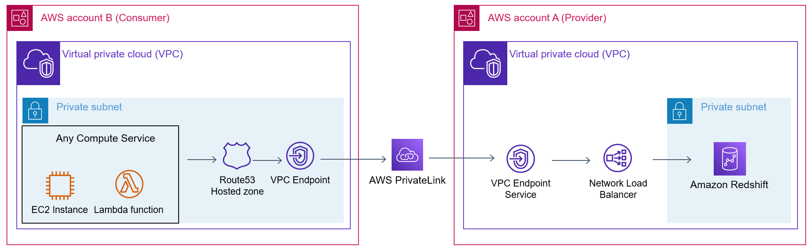

# Cross VPC Redshift Connector Application

## Overview:
This CDK Application is meant to be used as a guide for how to connect two AWS resources  in Private VPC Subnets in a Secure and Scalable way. 
This application is geared towards connecting to a Redshift cluster but can be used for any target supported by Network Load Balancers.

## Infrastructure Diagram:

### Security
This utilizes AWS PrivateLink which routes all traffic over AWS's network and keeps your data from traversing the public internet.
This method removes the need for VPC Peering and hardcoded allow-listing IP ranges. VPC Peering comes with its own caveats and enables access to all VPC resources.
This application/PrivateLink however, ensures that there is only one path being routed into your VPC/resources.

## How to get started
The stacks are created in `lib/application.ts` you have `EndpointProvider` and `EndpointConsumer` Constructs which you can modify to your liking. 
These work out of the box when utilizing the `ConsumerStack` and `ProviderStack` I broke these out as Constructs so that you may use them in your own cdk applications. 

1. Ensure you have your resources in two different VPCs/Private Subnets.
2. Adjust the parameters as necessary such as Redshift Endpoint Name, VPCIds, etc
3. Deploy the ProviderStack `cdk deploy provider` referencing your Redshift (or other target) details and VPC.
4. Deploy the ConsumerStack `cdk deploy consumer` referencing the necessary attributes. 

Of important note - to ensure that SSL works with Redshift - your VPC Endpoint name should be the same name as your Redshift's DNS name. 
That is the reason for having a Route53 record in place and ensures you are making secure connections. 

## Useful commands

 * `npm run build`   compile typescript to js
 * `npm run watch`   watch for changes and compile
 * `npm run test`    perform the jest unit tests
 * `cdk deploy`      deploy this stack to your default AWS account/region
 * `cdk diff`        compare deployed stack with current state
 * `cdk synth`       emits the synthesized CloudFormation template
